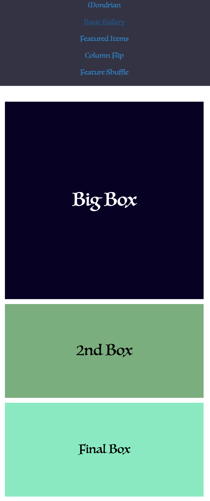
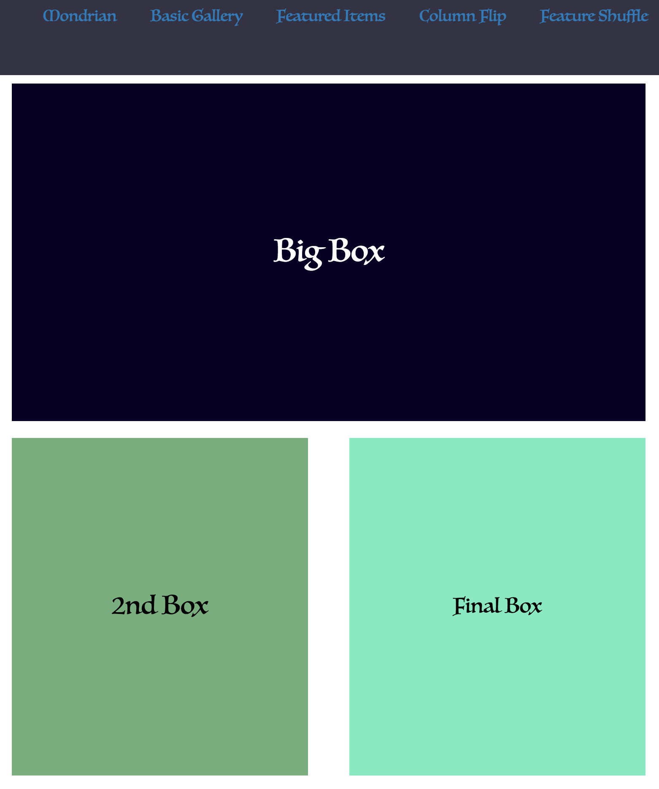
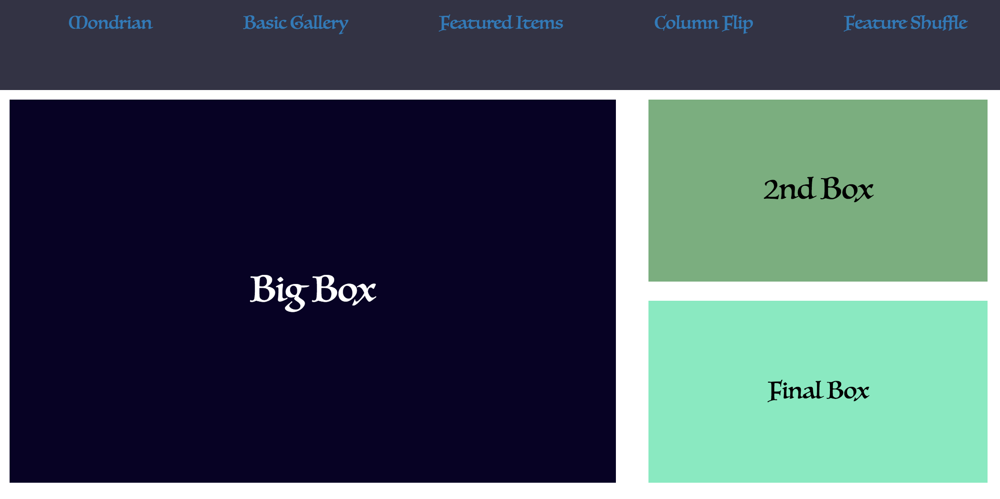

# _Responsive Patterns_

#### _{Media Query PRACTICE}, {Nov 29th, 2016}_

#### By _**Kyle Lange and Alex Jacks**_

## Description

_This is a PRACTICE website to work on some boilerplate responsive templates using flexbox, floats, and media queries at specific major breakpoints_

## See it live [HERE](https://kylelange.github.io/patterns/).

## Setup/Installation Requirements

1. Download this repo using your terminal: git clone repo-name pasted here

2. View the code by drag-and-dropping the file into your [favorite text editor](https://atom.io)

3. run/check-out the program by dropping the index/html file from your folder into your web browser

## Known Bugs

_There are no known bugs as of the last commit. Please send an ISSUE on github in the repository if you see something I have not._

## Support and Contact Details

_Any issues with this site, please [e-mail me] (baronsintrees@gmail.com) here._

## Technologies Used

1. **html**
2. **CSS and Bootstrap**
3. **Javascript and jquery-3**
4. **The Human Brain**

### License

ISC License

Permission to use, copy, modify, and/or distribute this software for any purpose with or without fee is hereby granted, provided that the above copyright notice and this permission notice appear in all copies.

THE SOFTWARE IS PROVIDED "AS IS" AND THE AUTHOR DISCLAIMS ALL WARRANTIES WITH REGARD TO THIS SOFTWARE INCLUDING ALL IMPLIED WARRANTIES OF MERCHANTABILITY AND FITNESS. IN NO EVENT SHALL THE AUTHOR BE LIABLE FOR ANY SPECIAL, DIRECT, INDIRECT, OR CONSEQUENTIAL DAMAGES OR ANY DAMAGES WHATSOEVER RESULTING FROM LOSS OF USE, DATA OR PROFITS, WHETHER IN AN ACTION OF CONTRACT, NEGLIGENCE OR OTHER TORTIOUS ACTION, ARISING OUT OF OR IN CONNECTION WITH THE USE OR PERFORMANCE OF THIS SOFTWARE.

Copyright (c) 2016 **_Kyle Lange & Alex Jacks_**
